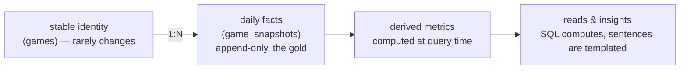
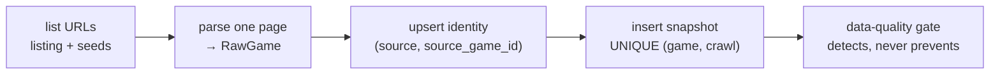
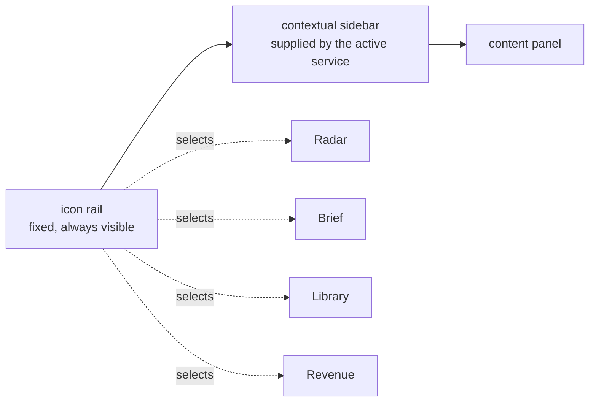

# KAIROS — Architecture & Design

**Purpose:** not a data display. A *decision engine* that tells a solo developer **what to build
next**: it finds underserved markets, tests ideas against comparables, and surfaces trends on Poki,
CrazyGames and Steam.

**The constraint behind every decision below:** one person operates it. It must run unattended,
cost next to nothing, and get *smarter* with every crawl. So the architecture optimises for **low
ops, append-only history and cheap incremental intelligence**, not for scale it doesn't have.

Generated facts (tables, routes, contract versions, the data-flow diagram) live in
[`docs/reference/`](docs/reference/). Dated decisions live in [`docs/decisions/`](docs/decisions/).
This document carries the design and the reasoning, and it describes the system as built.

---

## 0. The one idea that makes it "smarter over time"

Everything hinges on one discipline: **never overwrite; only append snapshots.** Each crawl writes a
new immutable row per game. All intelligence (growth, supply velocity, hidden gems, market gaps) is
*derived* from the snapshot series, so the more snapshots accumulate, the more signal there is.
History that was never captured can't be recovered later, which is why the crawl runs daily
whether or not anything reads it.

---

## 1. Overall architecture

KAIROS is a modular monolith: crawler adapters append snapshots to one Postgres database,
analytics queries read them, one API surface serves both entry points, and a single React SPA
renders every service. The current data flow, route groups and invariants are generated from the
code; see **[`docs/reference/architecture.md`](docs/reference/architecture.md)**.

| Decision | Chosen | Alternative | Why, for a solo operator |
|---|---|---|---|
| Topology | Modular monolith: crawler, API and web in one repo, run as separate processes | Microservices / event bus | One person can't operate a fleet. Clean adapter seams give most of the flexibility at a fraction of the ops. |
| Compute | Scheduled CI jobs + serverless web | Always-on server | A daily cadence leaves compute idle almost all the time. Pay-per-run beats a box to babysit. |
| Coupling to sites | One **adapter interface** per source | Hard-coded per site | A new portal means implementing one adapter and registering it. |
| Repository | One npm-workspaces monorepo (`shared`, `server`, `web`) | Polyrepo | Atomic changes across crawler, schema, contract and UI in one PR, with no version skew. |

---

## 2. Database schema

Three layers: **identity** (slow-changing), **facts** (append-only time series) and **derived**
(the `v_latest` view, which gives the current state of every game). Tables, columns and an ER
diagram are generated from `schema.sql`; see **[`docs/reference/schema.md`](docs/reference/schema.md)**.

The reasoning the generated reference can't carry:

| Decision | Why | Cost |
|---|---|---|
| Facts in a separate table from identity | Identity stays small while facts grow forever, without bloating every join | An extra join for "current state", which `v_latest` absorbs |
| Postgres over a time-series database | Daily granularity is not high-frequency ingest, and the analytics are relational: joins across genre, developer and tag matter far more than points per second | A few window queries written by hand |
| One `schema.sql` across PGlite and Neon | Same dialect locally and in production, so a query that works in dev works in prod | Bound to what both engines support |
| Migrations are additive only | An append-only fact table is only trustworthy if columns are never dropped or narrowed under the history already recorded | Retired columns go unused rather than being removed |
| Time-varying metrics live on the snapshot | Price, owners, rating, votes, followers and tier all change, so they sit beside rating/votes rather than on the identity row | Wider snapshot rows, mostly null for sources that don't carry a field |

---

## 3. API design

Every route the API serves is generated from the Express router; see
**[`docs/reference/api.md`](docs/reference/api.md)**. The surface is deliberately defined twice
(Express for local dev, a Netlify Function in production), and `routeParity.test.ts` fails the suite
the moment the two drift.

**Aggregation happens in SQL**, so every endpoint returns *chart-ready shapes* rather than raw rows
and the browser never reduces the corpus. The cost is many explicit endpoints instead of one generic
query endpoint; each is cacheable, documented, and offers no injection surface.

**The data contract is the coordination mechanism.** `shared/src/contract.ts` is the single source of
truth for payload shapes and taxonomy, served at `GET /api/contract` and enforced on write. Every
producer reads it before writing. Pitch
validation is **strict**, because it gates publishing; brief validation is **advisory**, so a format
lag can never blank the live dashboard. A shape or taxonomy change bumps its version in the same
commit. Current versions: [`docs/reference/contract.md`](docs/reference/contract.md).

---

## 4. Crawl & load (idempotent per crawl day)

- **Discovery.** Browser portal sitemaps carry no modification dates, so each run reads a **rotating
  window** of the sitemap, advanced by the source's crawl count, plus seeds: each portal's
  new-releases listing and, on CrazyGames, its homepage shelf. A fixed prefix would never discover a
  new release, and every supply-velocity signal would read a structural zero. Steam has no sitemap
  and discovers from seed lists instead (§7).
- **Idempotency.** One crawl row per source per day, and snapshots are unique on `(game, crawl)`.
  Re-running a day inserts nothing.
- **Failure isolation.** One game's fetch or parse error logs and skips; the run finishes. Every
  request goes through one polite fetch with a fixed user agent, a pause between requests and a
  per-request timeout, so a hung upstream fails fast instead of stalling the crawl.
- **Thumbnails are hotlinked** from the source's CDN and never re-hosted.
- **Detection, not prevention.** The load has already happened when the post-crawl gate runs. A
  degenerate crawl turns the run red rather than looking green (see [TEST_PLAN.md](TEST_PLAN.md)).
- **Tradeoff.** A snapshot of every game every day uses more storage than delta-only capture, but it
  makes every historical query a simple filter instead of event reconstruction. At daily granularity
  the storage is trivial.

**Politeness is a design rule, not a tuning detail.** A crawl limits volume per source, prefers the
portal's own JSON over rendered HTML, and never uses rate-limited bulk endpoints. The per-source
limits are tuned for the upstreams' tolerance, not for runner cost.

---

## 5. Analysis: SQL computes, sentences are templated

No language model runs inside the app. Every number is computed in SQL; every sentence the app
shows (the "this week's read" strip, insight lines, their "→ so what" implications) is a template
filled from those numbers. **A statistic the app states is one it computed**, which rules out
invented figures and keeps the runtime free.

Language-model work (writing the brief, drafting pitches, building prototypes) happens *outside* the
app in scheduled routines. It enters through token-gated write endpoints and the contract, so the
app stays deterministic and a routine's output is validated before it can reach a panel.

**Votes have a basis per portal.** Poki's vote count is a running total (`cumulative`); CrazyGames'
covers only recent engagement (`window`). `VOTE_BASIS` declares each portal, and raw counts on
different bases are never pooled, subtracted or ranked against each other
([decision](docs/decisions/2026-09-14-crazygames-votes-are-a-window.md)). It follows that:

- **Momentum is in the portal's unit.** A cumulative portal reads votes gained per day. A window
  portal reads the signed percent change per week of its engagement level; a trend needs at least
  three captures and a move of 5%/wk either way. On All Browser momentum is shown per portal, never
  pooled.
- **Levels on All Browser are within-portal percentiles.** Each title's votes become its percentile
  in its own portal's live catalogue before any median, sum or ordering, and the payload names the
  unit. Single-portal views keep raw counts.

**Market-gap ranking (the core read).** Each genre × tag cell is scored as
`z(demand) + z(quality ceiling) − z(supply)` over the cells being ranked. Three rules keep the
ranking honest:

- **A cell is a market only above a supply floor** (`MIN_MARKET_SUPPLY`, shared by both platforms). A
  two-game cell is a sample, and the negated supply term would otherwise reward the thinnest cells
  most.
- **Demand is continuous, never a bucketed estimate.** On a single portal or Steam it is a median
  count (votes or reviews); on All Browser it is the median within-portal vote percentile. A median
  of SteamSpy owner buckets ties unrelated markets on one value
  ([decision](docs/decisions/2026-07-20-steam-demand-is-median-reviews.md)).
- **Too few cells means no ranking.** Below a minimum cell count the list is empty rather than a z-score
  of the sample itself.

**Standing flags steer, they don't override.** The founder's standing interests add a visible lift to
matching markets *before* the sort and cut, scaled to the ranking's own shown band. Steering can
reorder comparable markets and bring a near miss onto the list, but it can never crown a new leader
over the one the market data put first. The steering lens reports what matched, what reached the list
and what fell just below.

**Hidden gems** are titles in the top rating quartile and bottom vote quartile *of their own
portal*, above a raw vote floor, ranked by a Bayesian-shrunk rating. Both percentiles partition by
portal, because the portals differ in vote basis and in rating distribution. On All Browser each
portal ranks its own gems and the list alternates between portals, so no rating or count is compared
across them. Age and momentum *annotate* the list without re-sorting it, so "not yet found" can be
told apart from "stalled".

---

## 6. The KAIROS shell

Radar is one of four services behind a thin icon rail:

- **One app, one deploy, and deliberately no router library.** The shell mounts every service at once
  and toggles them with a `hidden` prop, so switching costs no refetch and no remount. Services and
  sections are addressable by URL hash, so a link can still open a specific view.
- **One database, one namespace.** Radar's crawl tables sit beside `brief_editions`, `brief_steering`,
  `library_items` and `pitches`, so a pitch can join a market row without a federation layer.
- **Radar** reads the crawl. **Brief** renders editions the brief routine publishes as structured JSON.
  **Library** holds dated Pitches (contract-validated concepts scored on the five factors), playable
  Prototypes and a candidate Leaderboard. **Revenue** is a client-side model; its inputs and target
  never reach the server.
- **Mobile is a first-class target.** Every panel must work at 375px with no page-level horizontal
  scroll; wide tables scroll inside their own container.
- **Visual language:** a light theme that follows the system dark scheme, with Fira Sans for text and
  Fira Code for numbers (tabular figures).

---

## 7. The Steam source

Steam extends KAIROS from browser portals into PC-indie market intelligence, scoped to a **solo-dev
funnel**.

- **Indie-addressable by default.** Analytics default to the non-AAA cohort; AAA stays available as
  demand context, never as a benchmark.
- **AAA means publisher backing, not scale.** Steam has no budget field, so a scale tier is inferred.
  A self-published breakout caps at established-indie however large it grows; only a major-backed
  title is AAA. Matching publisher and developer labels is whole-word, because Steam shows short forms
  of long publisher names.
- **Free public endpoints only, no API key** (the list is in [OPERATIONS.md](OPERATIONS.md)). The seed
  interleaves a curated indie canon, recent indie top-sellers, the popular-upcoming shelf, trending,
  featured and the indie tag list round-robin, so the AAA-heavy lists can't crowd the indie stream
  out at small limits.
- **Released and upcoming are separate cohorts.** Market analytics read released titles only; upcoming
  titles get their own surface, where follower momentum stands in for wishlists
  ([decision](docs/decisions/2026-08-24-upcoming-cohort-gets-its-own-surface.md)).
- **Steam never feeds browser analytics.** Platform `all` means the browser portals only. Mixing
  Steam's crawl dates into a browser date axis corrupts every vote-velocity series.

---

## 8. The decision layer: five factors

KAIROS is organised around the five factors that pick a shippable game:

1. **Demand vs. recent supply**: is there appetite, and is the door closing?
2. **Platform-split revenue → route lean**: browser, Steam, or a ladder between them.
3. **Scope + loop-testability**: days to a testable gray-box loop, content scope, tech risk.
4. **Marketability / hook**: can it be sold in one line?
5. **Design value / founder pull**: does it fit the founder's taste and strengths?

How the surfaces answer them:

- **Radar opens with an answer.** A server-computed read of one to three decision-framed sentences
  comes before the charts, and each insight carries its "→ so what".
- **Names are canonical before aggregation.** Genre and tag names collapse a trailing "Game(s)" in SQL,
  before any median is taken, since medians can't be merged afterwards.
- **Supply has a velocity, not just a count.** New entrants in adjacent trailing windows, anchored to
  the data's newest date rather than the wall clock, flag a genre whose supply is rising. For a Steam
  tag the standing flags match, the count comes from the store's own release listing (the census),
  because the crawl only ever sees a tag's survivors; elsewhere a zero over a tiny crawled catalogue
  reads "not measured", never "quiet".
- **Demand and supply share one quadrant** per platform, coloured by supply momentum.
- **Steam economics carry context, not just totals.** A genre row carries a cited wishlist-to-sale
  signal where one exists, and median playtime reads as a content-expectation proxy, not a quality
  score.
- **Revenue is a range, not a point.** Projections show a P25 / median / P75 band, and a comparable
  can seed the model directly.
- **The Leaderboard ranks candidates by evidence state first**: a tested candidate beats an untested
  one, and the paper score only orders candidates at the same state.
- **A pitch is read through both lenses.** The pitch contract carries scope, hook and founder-fit fields
  beside the browser and Steam fit scores. A pitch-level route-lean chip reads browser fit against
  Steam fit. The market-level Route Lens joins the two platforms on **loop families**, because genre
  alone joins them too thinly ([decision](docs/decisions/2026-08-24-market-route-lens-joins-on-loop-families.md)).

---

## 9. Technology stack (as built)

| Layer | Choice | Why | Tradeoff |
|---|---|---|---|
| Language | **TypeScript everywhere** (crawler, API, web) | The local dev database is in-process JS, so a single language lets the crawler reuse the exact DB layer in dev and prod and share types with the contract | Gives up Python's scraping ecosystem; the portals serve JSON over HTTP, so little is lost |
| Server runtime | **`tsx`, no build step** | Nothing to compile or keep in sync | Explicit `.ts` import extensions throughout |
| Local database | **PGlite** (embedded Postgres, file-persisted) | Zero install, no Docker, and real Postgres dialect | Single-process, which is fine for dev and one crawl |
| Production database | **Neon** (serverless Postgres) | Same SQL as local, scales to zero between crawls | Serverless connection limits, irrelevant at this traffic |
| DB driver | **One `Querier` interface** | PGlite when `DATABASE_URL` is unset, Neon when present, with no code change | The production bundle must never load PGlite's wasm, so PGlite is imported through a variable specifier |
| Web | **Vite + React SPA** | For a single-user tool, SSR and SEO add complexity for no benefit | No server rendering |
| API | **Express (dev) / Netlify Function (prod), shared handlers** | Handlers live once in `server/src/queries`; only routing is duplicated | Routing drift, caught by the parity test |
| Charts | **Apache ECharts** | One library covers lines, treemap, heatmap, scatter and quadrant on dense data | Less per-chart polish than specialised libraries |
| Scheduler | **GitHub Actions** | Free on a public repo, versioned, survives losing any workstation | Coarse schedule control |
| Hosting | **Netlify** (static SPA + Function + edge auth) | Git-integrated, one deploy for web and API | Production deploys are metered, so they are batched daily |
| Lint / format | **Biome** | One fast tool, one config | Some rules disabled to reach a green baseline |
| Tests | **Vitest + Playwright** | Same runner for server and web; Playwright for browser e2e | Browser e2e is a local gate, not a CI one ([TEST_PLAN.md](TEST_PLAN.md)) |
