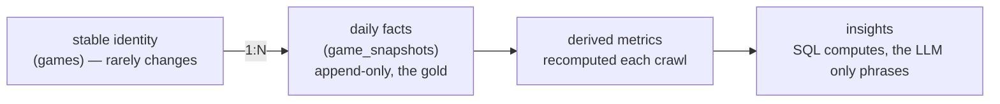
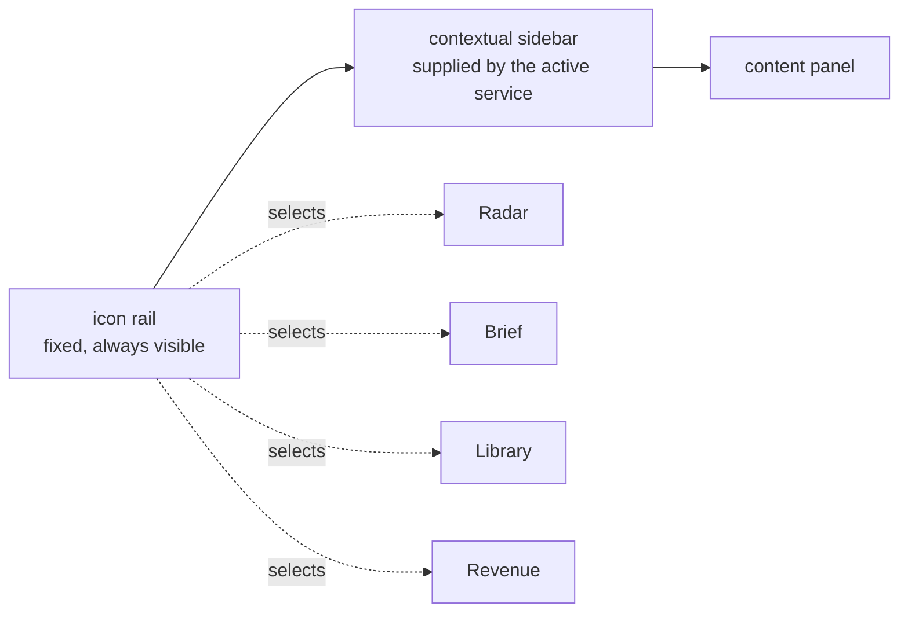

# Browser Game Market Intelligence — Architecture & Design

**Codename:** GameRadar
**Purpose:** Not a data display. A *decision engine* that tells a solo/indie developer **what to build next** by finding underserved opportunities, validating ideas, and surfacing trends on Poki & CrazyGames (and later itch.io, Steam, Epic, Newgrounds).

**Design constraint that drives every decision below:** this is operated by *one person*, must run unattended for years, cost near-zero, and get *smarter* with every crawl. So the architecture optimizes for **low ops, append-only history, and cheap incremental intelligence** — not for scale you don't have.

---

## 0. The one idea that makes it "smarter over time"

Everything hinges on a single discipline: **never overwrite; only append snapshots.** Each crawl writes a new immutable row per game. All "intelligence" (growth, saturation, feature-duration, breakouts, hidden gems) is *derived* from the diff between snapshots. The more snapshots you accumulate, the more signal you have — the system compounds for free.



---

## 1. Overall Architecture

KAIROS is a modular monolith: crawler adapters append snapshots to one Postgres database,
analytics queries read them, one API surface serves both entry points, and a single React SPA
renders every service. The current data flow, route groups, and invariants are generated from the
code — see **[`docs/reference/architecture.md`](docs/reference/architecture.md)**.

**Why this shape (tradeoffs):**

| Decision | Chosen | Alternative | Why chosen for a solo operator |
|---|---|---|---|
| Topology | Modular monolith (crawler + ETL + web in one repo, separate processes) | Microservices / event bus (Kafka) | One person can't operate a fleet. A monolith with clean adapter seams gives 90% of the flexibility, 10% of the ops. |
| Compute | Serverless cron + serverless web | Always-on Kubernetes | Daily cadence means compute is idle 99% of the time. Pay-per-run beats a box you babysit. |
| Coupling to sites | One **adapter interface** per source | Hard-coded per site | New sites (itch, Steam) = implement one class. This is the "easy to add websites later" requirement, satisfied structurally. |

---

## 2. Database Schema (PostgreSQL)

Three layers: **identity** (slow-changing), **facts** (append-only time series), and **derived**
(the `v_latest` view, which gives the current state of every game). Tables, columns, and an ER
diagram are generated from `schema.sql` — see **[`docs/reference/schema.md`](docs/reference/schema.md)**.

The reasoning that the generated reference cannot carry:

| Decision | Why | Cost |
|---|---|---|
| Facts in a separate table from identity | Identity stays small and clean while facts grow forever, without bloating every join | An extra join for "current state", which `v_latest` absorbs |
| Postgres over a time-series database | Daily granularity is not high-frequency ingest, and the analytics are relational — joins across genre, developer, and tag matter far more than points per second | A couple of window queries written by hand |
| One `schema.sql` across PGlite and Neon | Same dialect locally and in production, so a query that works in dev works in prod | Bound to the intersection of what both engines support |
| Migrations are additive only | An append-only fact table is only trustworthy if columns are never dropped or narrowed underneath the history already recorded | Retired columns go unused rather than being removed |

---

## 3. Folder Structure (monorepo)

```
browser-game-intel/
├─ crawler/                      # Python — extraction only
│  ├─ adapters/
│  │  ├─ base.py                 # SourceAdapter ABC: list_games(), parse_game()
│  │  ├─ poki.py                 # hits Poki's JSON/Next-data; Playwright fallback
│  │  ├─ crazygames.py
│  │  └─ __init__.py             # registry → add a site = drop a file here
│  ├─ fetch.py                   # polite HTTP: jitter, backoff, robots, UA, cache
│  ├─ run_crawl.py               # entrypoint: for each active source → adapter
│  └─ tests/                     # recorded HTML/JSON fixtures (offline tests)
├─ etl/                          # Python — transform + load
│  ├─ normalize.py               # raw → canonical dict
│  ├─ load.py                    # upsert identity, insert snapshot, diff
│  ├─ detect_engine.py           # heuristics: Unity loader, phaser.min.js, three.js
│  └─ refresh_views.py
├─ enrich/                       # Python — AI worker
│  ├─ queue.py                   # find games needing enrichment (new/changed/stale prompt)
│  ├─ prompt.py                  # versioned prompt template + JSON schema
│  └─ run_enrich.py
├─ db/
│  ├─ migrations/                # SQL migrations (sqitch / plain numbered .sql)
│  └─ schema.sql
├─ web/                          # Next.js (App Router) + TS
│  ├─ app/
│  │  ├─ (dash)/overview/page.tsx
│  │  ├─ (dash)/genres/…  tags/…  developers/…  trends/…
│  │  ├─ (dash)/hidden-gems/…  new-releases/…  market-gaps/…
│  │  ├─ games/[id]/page.tsx     # detail
│  │  └─ api/…                   # route handlers (or tRPC)
│  ├─ components/charts/         # EChart wrappers: Treemap, Heatmap, Network, Scatter…
│  ├─ lib/queries.ts            # typed SQL (Drizzle/Kysely)
│  └─ lib/insights.ts           # NL insight renderer
├─ insights/                     # cron job: stats → natural-language statements
├─ infra/
│  ├─ github-actions/crawl.yml   # daily schedule
│  └─ docker-compose.yml         # local Postgres for dev
├─ shared/                       # JSON schemas shared py<->ts (game, enrichment)
└─ DESIGN.md
```

**Tradeoff:** monorepo (one clone, one PR, shared schema in `/shared`) vs polyrepo. Monorepo wins for a solo dev — atomic changes across crawler+schema+UI, no version-skew juggling. Cost: CI must scope jobs to changed paths (trivial in GH Actions).

---

## 4. API Design

Every route the API actually serves is generated from the Express router — see
**[`docs/reference/api.md`](docs/reference/api.md)**. The surface is deliberately defined twice
(Express for local dev, a Netlify Function in production) and `routeParity.test.ts` fails the
suite the moment the two drift.

**Design choices:** aggregation happens in SQL, so every endpoint returns *chart-ready shapes* rather than raw rows — the browser is never asked to reduce the corpus. Tradeoff: many explicit endpoints instead of one generic `/query`, but each is cacheable, documented, and offers no SQL-injection surface.

---

## 5. ETL Pipeline (idempotent per crawl-day)

```
1. EXTRACT   adapter.list_games()  → ids/urls on homepage + listing pages
             adapter.parse_game()  → raw dict per game (+ download thumbnail once)
2. NORMALIZE map raw → canonical schema; coerce types; detect engine; clean tags
3. RESOLVE   match to games by (source_id, source_game_id):
                found → update last_seen_at;  new → INSERT identity + first_seen_at
4. SNAPSHOT  INSERT one game_snapshots row per game seen (immutable)
             INSERT game_tag_snapshots rows
5. DIFF      games seen yesterday but not today → is_live=false (removed)
             is_live games reappearing         → "returned"
             update crawls row (counts, status)
6. POST      REFRESH MATERIALIZED VIEW CONCURRENTLY (growth, feature_duration…)
             enqueue new/changed games for enrichment
             trigger insights job
```

**Idempotency:** keyed on `(game_id, crawl_id)` UNIQUE — re-running a day is a no-op, not a duplicate. **Failure isolation:** one game's parse error logs and skips; the crawl finishes `partial`, never aborts the whole run. **Tradeoff:** snapshot-every-game-every-day uses more storage than delta-only, but makes *every* historical query a simple filter instead of event-reconstruction — at daily granularity storage is trivial (≈ tens of MB/year for thousands of games).

---

## 6. AI Analysis Pipeline

Two distinct AI jobs — keep them separate:

**(A) Per-game enrichment** — infers the design DNA the sites don't expose.
```
queue: games WHERE no enrichment for current prompt_version
        OR description/tags changed (input_hash differs)
for each (batched, rate-limited):
   prompt(description, tags, category, screenshot-url, comparable signals)
   → Claude with a STRICT JSON schema (structured output)
   → validate → UPSERT enrichment(game_id, prompt_version, …)
cache: skip if input_hash already enriched at this prompt_version  → ~0 recurring cost
```
Inferred fields: core loop, minute-to-minute, meta progression, motivation, skill ceiling, complexity, session length, audience, comparables, likely inspiration, fun pillars, mechanics (primary/secondary), retention hooks, success/risk reasons, art style, camera, perspective, monetization.

**(B) Insight generation** — turns aggregates into the natural-language lines the spec wants. Hybrid: compute the *numbers* in SQL (deterministic, cheap, verifiable), let the LLM only *phrase* them. This prevents hallucinated statistics.
```
SQL detectors produce facts:  {metric, genre, value, direction, window}
e.g. {puzzle, weekly_feature_count, -38%, declining, 4w}
LLM templates them →
  "Puzzle games have declined for four consecutive weeks."
  "Driving games receive higher ratings (4.3) but 40% fewer features."
  "Only six successful physics-roguelites exist — an underserved cross."
```

**Market-gap detector (the money feature):** build a genre × mechanic (or tag × tag) matrix. For each cell compute **demand proxy** (avg plays/votes/popularity of games in it) and **supply** (game count). Flag cells where `demand high AND supply low` = opportunity. Rank by `demand_percentile − supply_percentile`.

**Tradeoffs:** SQL-computes-numbers / LLM-only-phrases avoids the classic "AI invented a statistic" failure and keeps cost down (insights = a few calls/day). Enrichment cost is bounded by *new* games, not total — so it stays flat as the corpus grows. Risk: inferred design fields are opinions; store `model`+`prompt_version` so you can re-run and audit, and show them as "AI-inferred" in the UI.

---

## 7. Dashboard Wireframes

Nine views, shared left sidebar + global filter bar. (Interactive mockup of Overview ships as `mockup/overview.html`.)

```
┌─ SIDEBAR ─┬─────────────── GLOBAL FILTER BAR (platform·genre·tags·rating·votes…) ───────────────┐
│ Overview  │  OVERVIEW                                                                            │
│ Genres    │  ┌ KPI ┐ ┌ KPI ┐ ┌ KPI ┐ ┌ KPI ┐   (games tracked · new/wk · avg rating · gaps)     │
│ Tags      │  ├─────────────── Genre momentum (line, growing↑/declining↓) ───────────────┤        │
│ Developers│  ├──── Tag treemap ────┬──── Rating×Votes scatter (hidden-gem quadrant) ────┤        │
│ Trends    │  ├──── Homepage-feature heatmap (genre × week) ─────────────────────────────┤        │
│ HiddenGems│  └──── AI insight feed (NL bullets, click → drill) ─────────────────────────┘        │
│ NewReleases│                                                                                     │
│ MarketGaps│                                                                                       │
│ ─────────  │                                                                                      │
└───────────┴──────────────────────────────────────────────────────────────────────────────────┘
```

- **Genre Explorer:** sortable genre table + momentum sparkline; click → genre profile (lifespan, avg feature duration, top games, saturation score).
- **Tag Explorer:** treemap (frequency) + **network graph** of co-occurring tags; click an edge → games at that intersection.
- **Developer Explorer:** table (games, success rate, cadence) + **network graph** dev↔genre; "repeat hit-makers" highlighted.
- **Trend Explorer:** multi-series time travel; rating changes, vote growth, trending duration; emerging-genre callouts.
- **Hidden Gems:** scatter (rating vs visibility) with the gem quadrant shaded + a ranked list.
- **New Releases:** this week's first-seen games, with early-trajectory mini-charts.
- **Market Gaps:** genre×mechanic **bubble/heatmap** (demand vs supply), opportunity list ranked.
- **Game Detail:** hero (thumb, title, dev, rating) · homepage-rank history line · vote-growth line · AI design breakdown (loop, mechanics, audience, comparables, success/risk) · tag chips · "similar games".

Visual language: **dark OLED**, blue data with amber highlights for opportunities/anomalies, Fira Sans body / Fira Code for numbers (tabular figures). Status colors green/amber/red for growing/flat/declining.

---

## 8. Roadmap

| Phase | Goal | Scope |
|---|---|---|
| **MVP (wk 1–3)** | See the data daily | CrazyGames + Poki adapters · Postgres + snapshot schema · daily GH Action · Overview + Genre + Game Detail pages · basic charts (line/bar/scatter) · **no AI yet** |
| **V1 (wk 4–8)** | Make it intelligent | Enrichment worker (Claude) · Tag co-occurrence + network graph · Hidden Gems · Market-Gap detector · NL insight feed · all 9 views · materialized metrics · filter bar |
| **V2 (wk 9+)** | Make it strategic & broad | itch.io + Steam + Newgrounds adapters · cross-platform genre comparison · forecasting (trend extrapolation) · "idea validator" (describe a concept → nearest comps + gap score) · saved watchlists · weekly email/Notion digest |

Ship MVP before any AI — the append-only history must start accruing *now*, because V1's intelligence is worthless without weeks of snapshots behind it. **Start crawling on day one even if the UI is ugly.**

---

## 9. Technology Stack

| Layer | Recommendation | Why | Main alternative (tradeoff) |
|---|---|---|---|
| Crawler | **Python + Playwright + httpx** | Poki/CrazyGames are JS apps; Playwright renders, but prefer their internal JSON endpoints. Python = best scraping ecosystem | Node + Puppeteer (fine; Python wins on data tooling) |
| Storage | **PostgreSQL (Supabase free → Neon)** | Relational analytics + JSONB + materialized views + free managed tier + auto REST | SQLite+Litestream (cheapest, single-writer; great for laptop MVP, weaker concurrent analytics) |
| ETL/Enrich | **Python scripts** (no orchestrator) | Daily, linear DAG — a 200-line script beats Airflow | Dagster/Prefect (overkill until many sources) |
| Scheduler | **GitHub Actions cron** | Free, serverless, versioned, no box to patch | VPS cron / Win Task Scheduler (more control, more ops) |
| AI | **Claude (Opus for enrich, structured JSON)** | Best design inference + strict schemas; cache by hash | local LLM (cheaper, weaker reasoning) |
| Web/API | **Next.js (App Router) + TypeScript** | SSR + route handlers + ISR caching in one; huge ecosystem | SvelteKit (lighter); FastAPI+React (more glue) |
| Data layer | **Drizzle or Kysely** (typed SQL) | Type-safe queries, no heavy ORM | Prisma (heavier, slower cold start) |
| Charts | **Apache ECharts** (+ D3 for bespoke network) | *One* lib covers treemap, heatmap, **graph/network**, scatter, bubble, line — performant on dense data | Recharts (no treemap/network); Plotly (heavier, licensing) |
| Tables | **TanStack Table** | Sort/filter/virtualize big lists client-side | AG Grid (heavier) |
| Hosting | **Vercel (web) + Supabase (db)** | Both generous free tiers, zero-ops, git-push deploy | Fly.io / single VPS (1 box for all, more control + more upkeep) |
| Thumbnails | **Supabase Storage / Cloudflare R2** | Cache once, don't re-hit sites; cheap egress | Hotlink (rude, breaks, rate-limit risk) |

**Crawler strategy & politeness:** identify with a real UA + contact URL; respect `robots.txt`; **1 request / 2–5s with random jitter**, single concurrency per host; exponential backoff on 429/5xx; cache thumbnails so you fetch each once; prefer documented/internal JSON over scraping HTML (more stable, lighter). Daily cadence is inherently gentle — you are a considerate guest, which also keeps you un-blocked long-term.

**Caching:** (1) materialized views for heavy aggregates, refreshed at end of ETL; (2) a precomputed `overview` payload; (3) Next.js ISR / `revalidate` so pages serve cached HTML between crawls; (4) HTTP cache headers on chart endpoints (data changes ≤1×/day).

**Maintenance strategy (self-annealing):** record fixtures (saved HTML/JSON) so adapter tests run offline; when a site changes layout and the adapter breaks, the crawl logs `partial`, alerts you (push/Notion/Lark), and you patch *one* adapter + update its fixture. Schema migrations are numbered SQL. Because history is append-only, a bad crawl can be deleted by `crawl_id` without corrupting the series.

---

## 10. Mockups

Interactive dark-mode Overview ships as `mockup/overview.html` (open in a browser). It demonstrates the visual language, KPI strip, genre-momentum lines, tag treemap, rating×votes hidden-gem scatter, feature heatmap, and the AI insight feed with realistic sample data.

---

## 11. Major Tradeoffs — at a glance

| Decision | We chose | Because | We gave up |
|---|---|---|---|
| Overwrite vs append | **Append-only snapshots** | Intelligence is the *diff*; history can't be reconstructed later | More storage (trivial at daily scale) |
| DB | **Postgres** | Relational analytics across genre/tag/dev | Niche TSDB ingest speed (don't need it) |
| Scheduler | **Serverless cron** | Zero ops for a solo operator | Fine-grained runtime control |
| AI numbers | **SQL computes, LLM phrases** | No hallucinated stats; cheap | Slightly more plumbing |
| Charts | **ECharts** | Treemap+heatmap+network+scatter in one lib | Smaller per-chart polish vs specialized libs |
| Topology | **Modular monolith + adapter seams** | Operable by one person; new sites = one file | Not "web-scale" (irrelevant here) |
| Render vs API | **Prefer internal JSON, render as fallback** | Stability + politeness + speed | Some reverse-engineering per site |

**Single most important rule:** ship the crawler and the append-only schema *first*, run it daily starting now — every day you wait is a day of market history you can never get back.

---

## 12. Addendum — KAIROS Command Center & as-built MVP decisions

This addendum supersedes earlier specifics where they differ. It records the shell concept and the build-stack choices made for an MVP that one person can build, verify, and operate.

### 12.1 KAIROS shell (the command center)

GameRadar is **Service #1** inside KAIROS, a hub whose four services sit behind a thin icon rail:



- **One app, one deploy, one URL, and deliberately no router.** The shell mounts every service at once and toggles them with a `hidden` prop, so switching a service costs no refetch and no remount. The rail is fixed; the service that is active supplies the contextual sidebar.
- **One database, one namespace.** Radar's `games` / `game_snapshots` / `tags` (§2) sit alongside `brief_editions`, `brief_steering`, `library_items`, and `pitches` in the same database, so a pitch can join a market row without a federation layer.

The columns of `brief_editions`, `brief_steering`, `library_items`, and `pitches` are generated
from `schema.sql` — see **[`docs/reference/schema.md`](docs/reference/schema.md)**.

- **News Brief integration:** the Mon/Thu routine keeps producing its **local HTML** (`Documents\KAIROS\Output\<brief>\`) and its Notion copy; it gains **one step** — upsert the edition's *structured JSON* into `brief_editions`, the source of truth KAIROS renders. Local HTML stays for offline portability; the DB holds queryable, cross-linkable data. `rendered_html` is an optional cached render for the simplest Brief tab.
- **Library:** schema reserved; UI is an intentional empty state until V2.

### 12.2 As-built stack decisions (revisions to §9) — with tradeoffs

| Topic | Earlier rec | **As-built (MVP)** | Why revised |
|---|---|---|---|
| Crawler language | Python + Playwright | **TypeScript** | Local dev DB is in-process JS (PGlite); a Python process can't write to it. Going single-language (Node everywhere) lets the crawler reuse the exact DB layer in dev *and* prod, shares types with the schema, and removes a toolchain. CrazyGames/Poki data is largely JSON-over-HTTP, so Playwright is optional (Node has a first-class Playwright API if rendering is needed). **Tradeoff:** give up Python's richer scraping ecosystem; gain one language + frictionless local verification. |
| Local database | (Supabase/SQLite) | **PGlite** (embedded Postgres, file-persisted) | No Docker on the workstation; PGlite needs zero install and is *real* Postgres dialect, so the same SQL runs locally and on Neon. **Tradeoff:** PGlite is single-process (fine for dev/crawl); Neon handles prod concurrency. |
| Web framework | Next.js (SSR/ISR) | **Vite + React SPA + API handlers** | For a single-user internal intel tool, SSR/SEO add complexity with little benefit. SPA + Netlify Functions is faster to build, verify, and deploy on the free tier. **Tradeoff:** lose ISR/SSR; for this audience that's immaterial, and the handlers still map 1:1 to Netlify Functions. |
| DB driver | — | `@electric-sql/pglite` (dev) / `pg` or `@neondatabase/serverless` (prod), behind one `query()` | Switch by `DATABASE_URL` presence; no code change between envs. |

Everything else in §1–§11 (append-only snapshots, derived views, market-gap detector, AI insight pipeline, politeness, caching) stands unchanged.

---

## Phase 2 — Steam (PC) source (added 2026-06-30, data layer)

Extends KAIROS beyond browser portals into PC-indie market intel, scoped to a **solo-dev funnel**: analytics default to the **indie-addressable cohort**; AAA is kept as demand context, not a benchmark.

**Sources & endpoints (free, no API key):**
- `store/api/appdetails` → price, release_date, genres, developers/publishers, metacritic
- `store/appreviews/<id>?filter=summary` → `total_positive`/`total_reviews` → rating (0–5) + votes
- `steamspy api.php` → owners (→ `plays`/`owners_est`), ccu, playtime, weighted tags
- Seed: SteamSpy `tag=Indie` (indie coverage) + `top100in2weeks` + storefront `featuredcategories`, **round-robin merged** (`mergeSeeds`) so the AAA-heavy lists can't crowd out indies at small limits.

**Schema additions (additive, idempotent `ALTER … IF NOT EXISTS` for Neon):** `games.release_date`; `game_snapshots.{price_cents, discount_pct, owners_est, ccu, median_playtime_min, metacritic, scale_tier}`. Time-varying metrics live on the append-only snapshot, consistent with rating/votes/plays.

**Adapter (`crawler/steam.ts`):** pure, unit-tested transforms — `parseOwners`, `normalizeSteamRating`, `isSelfPublished`, `classifyScaleTier` (`hobby|small_indie|est_indie|aaa`, inferred from reviews+owners+self-published since Steam has no budget field), `parseReleaseDate`, `parseSteamGame` — plus a network `steamCrawl` orchestrator. Reuses the existing append-only `loadGames`.

**Queries:** `getScaleTierBreakdown(platform)`; `getSteamGenreEconomics({cohort})` — per-genre games/median price/median rating/total owners/revenue-proxy, **indie-default** (excludes `aaa`), `cohort:'all'` for the demand-context view. `Platform` type + `pf()` extended with `'steam'`.

**Run:** `npm run crawl:steam` (CRAWL_LIMIT caps). Live validation: `npx tsx server/scripts/validate-steam.ts`.

**Deferred (next build):** promotion-capture homepage crawl (CrazyGames/Poki featured/trending → `featured`/`homepage_position`); React UI surfaces (Bridge / Comparables / Opportunity board + Steam in the platform selector) and their API routes; daily `crawl.yml` Steam step. Full design + rationale: `OneDrive\Claude-Config\handoff\` and the Phase 2 decision report (`Documents\Claude-Reviews\KAIROS-Phase2-Feasibility.html`).

### Phase 2 UI (added 2026-06-30)
Steam is a fourth platform in the GameRadar selector. Selecting it renders a dedicated **SteamView** (asymmetric — browser charts don't apply): KPIs (games / indie cohort / AAA context / rated %), a scale-tier distribution bar (`tierBarOption`, indie blue / AAA grey), a genre-economics table with an **indie ↔ all-tiers** cohort toggle (owners × price revenue proxy), and an indie **comparables** table. Served by `GET /api/steam` → `getSteamOverview()` (Express dev + Netlify function). Bridge (browser→Steam) and a Comparables deep-dive remain the next UI stage.

---

## Phase A/B/C — the 5-factor decision layer (added 2026-07-11)

A three-phase pass that reoriented KAIROS around the five factors that pick a shippable game — **(1) demand vs. recent supply, (2) platform-split revenue → route lean, (3) scope + loop-testability, (4) marketability/hook, (5) design value / founder pull**. All server work is **payload extensions on the existing `/api/overview` + `/api/steam` routes** (no new routes → route-parity untouched) plus contract/UI changes. Source of truth for the shapes: `shared/src/types.ts` + `shared/src/contract.ts`; all analytics live in `server/src/queries/index.ts`.

**Phase A — the decision layer ("so what?" per tab).** Every service now opens with an answer, not just data. `Overview.read` / `SteamOverview.read` are 1–3 server-computed, decision-framed sentences (top gap with its route framing, biggest mover, supply-pressure warning); `Insight.implication` adds a "→ so what" clause to each AI insight; `GenreRow.trajectory` is a demand delta. Revenue gained a P25/median/P75 scenario band; Comparables → Revenue "project" prefill; Library a candidate **Leaderboard** ranked by evidence state.

**Phase B — demand/supply truthing.**
- **B1 taxonomy canonicalization (the gate).** `canonicalName()` / `canonSql(col)` collapse a trailing `" Game(s)"` at every genre + tag `GROUP BY` (in SQL, before aggregation — medians can't merge after), so "Puzzle" / "Puzzle Games" are one row. Identity on clean names; JS/SQL parity-tested. Resolves #7/#15.
- **B2 supply velocity.** `classifySupply` + `genreSupplyTrend` (new-entrant momentum over trailing windows anchored to the data's max date). Adds `GenreRow.supplyTrend`/`recentEntrants` and a `supplyRising` flag on `MarketGap`/`SteamGap` (the z-score is unchanged — the flag annotates "the door is closing").
- **B3 demand/supply quadrant.** `getGenreQuadrant` / `getSteamGenreQuadrant` → `Overview.quadrant` / `SteamOverview.quadrant` (`QuadrantPoint`: supply × appetite, bubble = weight, colour = supply momentum). `quadrantOption` chart.
- **B4 small wins.** `SteamGenreEconomics.conversion` from the new **`server/src/data/genreConversion.ts`** (cited, dated wishlist→sale signal per genre); median-playtime reframed as a content-expectation proxy; pitch provenance receipt; recent-release chip.

**Phase C — the pitch, read through both lenses.**
- **C1 pitch v5** (`contract.pitch.version` 4→5, top-level 3→4). Adds the scope block (`grayBoxDays` — days to a testable gray-box loop, `contentScope` via the new `contentScopes` taxonomy, `techRisk`), the hook lens (`hook` + `marketability` score — absorbs #26's "Grab"), and the founder-fit lens (`founderFit` score + `whyMe`). `scoreFields` is now the five 1..3 axes. Additive `pitches` columns (null-safe, no backfill); the `/kairos-pitch` skill authors them.
- **C2 route lens.** `web/src/lib/routeLean.ts` turns a pitch's `browserFit` vs `steamFit` into a route-lean chip (browser-heavy → Routes 2/3, Steam-heavy → Route 1, both strong → optionality). The market-level cross-platform version is deferred to backlog (#67, blocked on the loop-family map #12 — genre alone joins the two surfaces too thinly).
