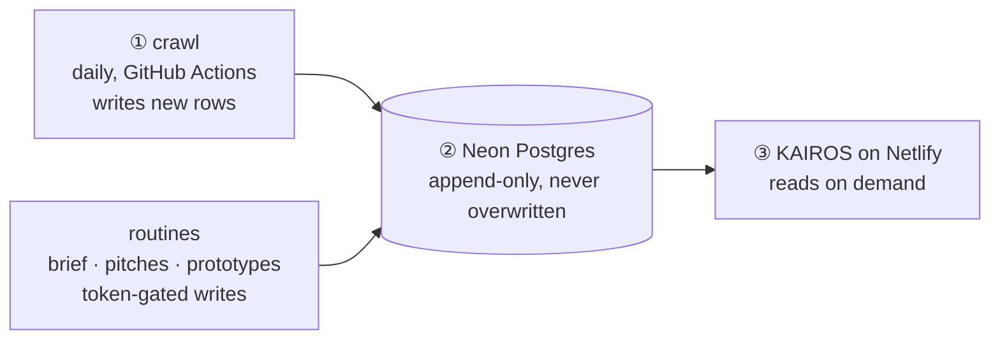

# KAIROS — How It Runs & Is Maintained

The mental model: **three things run on different clocks, and they only meet at the database.**

The crawl doesn't build the site, and the site doesn't trigger the crawl. If the site is down, data
still collects; if a crawl fails, the site still shows the last good data. Nothing durable lives on a
workstation, so losing any machine costs nothing.

Architecture and design reasoning: [DESIGN.md](DESIGN.md). Local setup and commands: [README.md](README.md).

---

## Where each part runs

| Part | Runs on | Notes |
|---|---|---|
| Database | **Neon** in production, **PGlite** locally | Same `schema.sql` and SQL; the driver is chosen by whether `DATABASE_URL` is set |
| Web + API | **Netlify**: static SPA, one `/api/*` Function, one edge function | The Function takes precedence over the SPA fallback |
| Access gate | Netlify edge function, HTTP Basic auth | Controlled by `SITE_PASSWORD` / `SITE_USER`. With no password set the gate is **open** by design, so a missing variable can't lock anyone out. The contract read and the producer endpoints (brief publish and steering, pitch writes and deletes, library writes) bypass it; the writes carry their own `PUBLISH_TOKEN` bearer auth |
| Daily crawl + gate | **GitHub Actions** | Public repo, so standard runners are free |
| Scheduled routines | A workstation's scheduled tasks | Content routines write only through token-gated endpoints, so they need the API URL and `PUBLISH_TOKEN`, never the database. The implementation routine changes code through PRs like any contributor, and can deploy and dispatch `migrate.yml` itself |

## Services and their data

| Service | Reads | Written by |
|---|---|---|
| Radar | `games`, `game_snapshots`, `tags` | The daily crawl |
| Brief | `brief_editions`, `brief_steering` | The brief routine: editions via `POST /api/brief/publish`, standing flags via `POST /api/brief/steering` |
| Library | `pitches`, `library_items` | The pitch and prototype routines, via `POST /api/pitches` and `POST /api/library`; `db:migrate` also keeps the built-in prototype cards present |
| Revenue | Nothing server-side | A client-side model; the target is per-browser local storage |

## Workflows

Each workflow's own comments are authoritative for schedules, limits and measured timings; this table
says what each one is for.

| Workflow | Trigger | Does |
|---|---|---|
| `ci.yml` | Every PR to `main`, plus manual | **The required merge gate:** lint → test → build. Branch protection blocks merging until it is green |
| `auto-merge.yml` | Non-draft PRs | Enables GitHub auto-merge, so a PR merges itself once CI passes. Nothing is merged by hand |
| `deploy.yml` | Scheduled (see its cron), plus manual | Ships `main` to Netlify **only if it changed** since the last deploy, and moves the **`live` tag** onto what is in production. No `NETLIFY_AUTH_TOKEN` secret, no deploy |
| `crawl.yml` | Daily, plus manual | Migrate schema → crawl CrazyGames → Poki → Steam → data-quality gate → Steam release census. A failure opens or updates one issue in the backlog |
| `migrate.yml` | Manual | Applies additive schema changes (and idempotent data backfills) to Neon |
| `backfill-tiers.yml` | Manual | Re-classifies stored Steam rows after a scale-tier rule change |
| `check-data.yml` | Manual | Runs the data-quality gate against Neon without crawling |

**Why deploys are batched.** Netlify meters production deploys and does not meter draft deploys. So
merges pile up on `main` and ship at most once a day. An automated run that has already deployed moves
`live` itself, and the daily job then skips. Don't run a manual production deploy unless you mean to
bypass the batch.

## Secrets and configuration

| Name | Where | Used by |
|---|---|---|
| `DATABASE_URL` | GitHub Actions secret + Netlify environment | Crawl, migrations and gate (Actions); the API Function (Netlify). Unset locally, which selects PGlite |
| `NETLIFY_AUTH_TOKEN` | GitHub Actions secret | `deploy.yml`, and its presence is the deploy on-switch |
| `PUBLISH_TOKEN` | Netlify environment + the routines' local config | Bearer auth on every producer write endpoint |
| `SITE_PASSWORD`, `SITE_USER` | Netlify environment | The edge access gate; unset means open |

No secret lives in code.

---

## Steam crawl specifics

- **No API key.** Per app: store app details, the review summary and SteamSpy, plus the store page
  and the community group page for the enrichments that need them (AI disclosure, followers).
  Requests are throttled per app, and the community fetch backs off, because Steam Community
  throttles hardest.
- **SteamSpy's bulk `all` endpoint is never used**; it is limited to one request a minute. Only
  per-app lookups and the trending and indie-tag lists are read.
- **The release census reads the store's search listing, not app pages.** One tag list request,
  then one 100-row "newest first" search page per tag the standing flags match (at most 15), into
  `tag_census`. It parses store HTML, so it fails loudly: the step goes red only when every tag
  fails, and supply falls back to the crawl sample once a tag's newest census row is over 7 days old.
- **`CRAWL_LIMIT` per source is set in `crawl.yml`.** It is a politeness setting, not a cost one
  (see [DESIGN.md §4](DESIGN.md#4-crawl--load-idempotent-per-crawl-day)).

---

## Maintenance

| When | What you do | Effort |
|---|---|---|
| **Never (automatic)** | Daily crawl and snapshot append · PRs merge on green CI · a daily deploy only when `main` changed | 0 |
| **A portal changes its markup** | The gate or crawl goes red and an issue appears → fix *one* adapter and refresh its captured fixture | ~30 min, rare |
| **A new source** | Implement a `SourceAdapter`, register it in `server/src/crawler/run.ts`, add a crawl step | A few hours |
| **A schema change** | Additive DDL in `schema.sql`; it reaches Neon through `db:migrate`, which the crawl runs first | Minutes |
| **A bad crawl** | Delete its snapshots by `crawl_id`; append-only history means no other data is touched. Keep the `crawls` row, because the sitemap rotation counts crawls | Minutes |

Two habits keep it self-healing: captured HTML/JSON fixtures let adapter tests catch breakage
offline, and the crawl's failure reporter puts a broken run in the issue backlog, where the routines
already look, instead of in an easily missed email.
