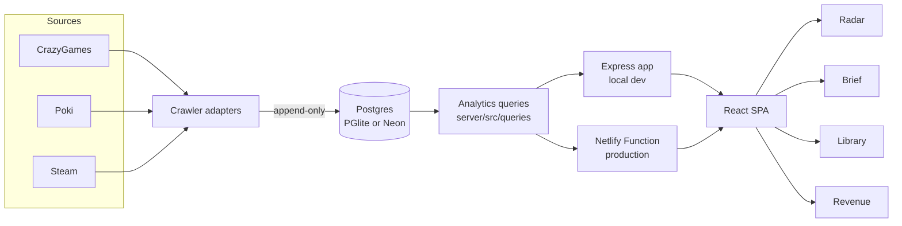

<!-- GENERATED FILE — DO NOT EDIT BY HAND.
     Source: derived from schema.sql + the Express router
     Regenerate: npx tsx app/server/src/scripts/gen-docs.ts
     A drift check (app/server/test/docsDrift.test.ts) fails the suite if this is stale. -->

# Architecture reference

Crawlers append snapshots; analytics queries read them; one API serves both entry points; the
SPA renders four panels. 10 tables, 1 view, 18 routes.

## Route groups

- `/api/brief`
- `/api/contract`
- `/api/developers`
- `/api/genres`
- `/api/health`
- `/api/hidden-gems`
- `/api/library`
- `/api/new-releases`
- `/api/overview`
- `/api/pitches`
- `/api/steam`

## Invariants worth knowing

- **Snapshots are append-only** — trends are computed over time, never overwritten.
- **The API surface is defined twice** (Express + Netlify Function); `routeParity.test.ts` fails on drift.
- **The contract is versioned**; a shape or taxonomy change must bump its version in the same commit.
- **This file is generated** — edit the generator, not the output.
